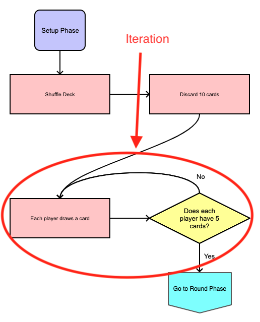

# Flow Charts and Board Games

## Overview

In this project, you will dissect the game 5-2-1-1 and translate its
instructions into a flow chart that you will use to identify key components in
the source code of a computer implementation of the game.

Additionally, you will select another game of your choice and translate its
instructions into another flow chart that you will use to identify key
components that you would have to write if you were to create a computer
implementation.

* [Sign up for the project](#sign-up-for-the-project)
* [Clone your repository](#clone-your-repository)
* [Milestone 1](#milestone-1)
    * [5-2-1-1 Flow Chart](#5-2-1-1-flow-chart)
    * [Identifying Code](#identifying-code)
        * [Code Segment 1](#code-segment-1)
        * [Code Segment 2](#code-segment-2)
        * [Code Segment 3](#code-segment-3)
    * [Milestone 1 Deliverables](#milestone-1-deliverables)
* [Milestone 2](#milestone-2)
    * [Select a Game](#select-a-game)
    * [Create a Flow Chart for your game](#create-a-flow-chart-for-your-game)
    * [Milestone 2 Deliverables](#milestone-2-deliverables)
* [Milestone 3](#milestone-3)
    * [Milestone 3 Deliverables](#milestone-3-deliverables)
* [Grading](#grading)
    * [Computational Thinking](#computational-thinking)
    * [Computing, Programming, and
      Practice](#computing-programming-and-practice)
    * [Skills of a Programmer](#skills-of-a-programmer)
* [Getting Help](#getting-help)
* [Appendix A: Flow Chart Components](#appendix-a-flow-chart-components)
* [Appendix B: Keywords](#appendix-b-keywords)
* [Appendix C: README.md](#appendix-c-readmemd)

## Sign up for the project

Sign up for the project here:
[https://classroom.github.com/a/spbOsNka](https://classroom.github.com/a/spbOsNka)

## Clone your repository

After you have signed up for the project, you can clone it using Github Desktop.


1. Click the Current Repository drop down


2. Click `Add` > `Clone Repository`


3. Select the `GitHub.com` tab


4. Select the `flow-charts-and-board-games-XXXXX` respository and click clone


5. Open the project in `Visual Studio Code`

## Milestone 1

Due Dates: 
* **E Period** - Wednesday Sept 8th @ 11:59 PM 
* **C Period** - Thursday Sept 9th @ 11:59 PM

For Milestone 1, you must translate the rules for a 2 player game of 5-2-1-1
into a flow chart using the provided Entry Points, Processes, Decision,
Connectors, and Terminal blocks. For more information on each block, see
[Appendix A](#Appendix-a-flow-chart-components)

After completing the flow chart, you will examine the source code for a 5-2-1-1
simulator and identify components which show Sequences, Selection, and Iteration
matching those from the provide flow chart components. For more information on
Sequence, Selection, and Iteration, see [Appendix B](#appendix-b-keywords)

### 5-2-1-1 Flow Chart

* 5-2-1-1 Rules: [DOC](https://tinyurl.com/5211-rules)
* Flow Chart Components: [PDF](support/components.pdf)

The components provided in the PDF above contain everything necessary (and
likely more) to complete a flow chart of a 2 player version of 5-2-1-1. For this
milestone, you may work in groups of up to 3 students.

* The flow chart you create may only contain the components provided in the PDF
  above. You may not create your own blocks.
* The flow chart must either be hand drawn or assembled from cut outs using the
  PDF above.

### Identifying Code

Below are three code segments for a computer implementation of 5211. For each
code segment, do the following:

1. Identify a **significant** sequence or state that there are no significant
   sequences. Explain why the sequence you selected is significant or why there
   are no significant sequences.

2. Identify a section that shows **selection** or state that there is no
   selection. If applicable, explain the conditions of the selection and the
   result of each condition.

3. Identify a section that shows **iteration** or state that there is no
   iteration. If applicable, Under what conditions does the iteration occur
   continue? Under what conditions does the iteration stop? What is the end
   result of the iteration?

#### Code Segment 1

The following is a segment of source code which is used in a 5211 simulator.

```typescript
       if (state.countValue(1) === 4) {
            state.discardValue(2);
            state.discardValue(3);
            state.discardValue(4);
            state.discardValue(5);
            state.discardValue(6);
        }
```


#### Code Segment 2

The following is a segment of source code which is used in a 5211 simulator.

```typescript
    state.deck.shuffle();
    state.deck.discard(10);
    while (state.getHandSize() < 5) {
        state.playerDrawCard();
    }
```


#### Code Segment 3

The following is a segment of source code which is used in a 5211 simulator.

```typescript
    state.playersPlayCard();
    state.playersPlayCard();
    state.flipUpCards();

    while (true) {
        if (state.deck.isEmpty() == false) {
            while (state.getHandSize() < 5) {
                state.playerDrawCard();
            }
        }

        if (state.countCardsInPlay() == 4) {
            break;
        }
        state.playersPlayCard();
        state.flipUpCards();
    }
```


### Milestone 1 Deliverables

To submit Milestone 1, you should create a new folder in your project named
`5211`. Within the folder, you should include a README.md file containing your
identified Sequences, Selection, and Iteration. For help creating a properly
formatted README.md file, see [Appendix C](#appendix-c-readmemd). 

In addition to your README.md file, you should also include an image for each of
the flow charts you or your group made. These may be scanned or pictures taken
with a camera. They should not be made digitally.

When all of your work has been committed and pushed, you will create a tag
called `milestone-1`. To do this:

1. Open Github Desktop
2. Open your project repository
3. Select the `History` Tab
4. Right click on the commit that will be your submission
5. Click `Create Tag`
6. Name the tag `milestone-1`
7. Click `Push origin`
8. Verify your tag is available on Github

## Milestone 2

Due Dates: 
* **E Period** - Monday Sept 13th @ 11:59 PM 
* **C Period** - Tuesday Sept 14th @ 11:59 PM

For Milestone 2, you will translate the rules for a game of your choosing into a
flow chart. You will create all of your own Entry Points, Processes, Decision,
Connectors, and Terminal blocks. Remember, keeping the blocks as simple as
possible will make it easier to translate into a computer program. If a decision
block feels as though it requires multiple smaller questions to answer, you
should break it into those smaller questions. 

For this milestone, you are expected to work individually.

### Select a Game

First, select a game and ask your instructor to approve it. You can do just
about any game you want. However, if you choose a game that is complex, your
flow chart will require more time. You will have at least one class period
dedicated to this Milestone and are expected to work on it outside of class for
at least one hour. Try to gauge the complexity to about 2 hours of work.

### Create a Flow Chart for your game

Now that you have selected a game, create a flow chart for it. Start by
sketching out the overall structure of the game: identify the major sequences,
selections, and iterations. Once you have a basic idea of the overall structure
choose your Entry Points and think about where you will add connectors. Finally,
fill in your sequences.

For this section of the project you may draw your flow chart or use computer
software to create it. **Note**: It typically takes longer to make a flow chart
on a computer. Mx. Collard likes this software:
[https://pencil.evolus.vn/](https://pencil.evolus.vn/)

### Milestone 2 Deliverables

To submit Milestone 2, you should create a new folder in your project named
after your game. Within the folder, you should include a README.md file
containing the name of your game and your flow charts.

The images may be scans, pictures taken with a camera, or digitally created
images.

When all of your work has been committed and pushed, you will create a tag
called `milestone-2`. To do this:

1. Open Github Desktop
2. Open your project repository
3. Select the `History` Tab
4. Right click on the commit that will be your submission
5. Click `Create Tag`
6. Name the tag `milestone-2`
7. Click `Push origin`
8. Verify your tag is available on Github

## Milestone 3
Due Dates: 

* **E Period** - Wednesday Sept 15th @ 11:59 PM 
* **C Period** - Friday Sept 17th @ 11:59 PM

### Identifying Components 
For this milestone, you will deconstruct your flow chart and identify key
components. atleast 5 components (Proficient). You must identify at least 1
significant sequence, 1 selection, and 1 iteration. **Note**: To receive a score
of Advanced for Computational Thinking, you must provide at least 2 examples of
each.

For each sequence, you must explain why the sequence is significant.

For each selection, you must explain the conditions of the selection and the
result of each condition.

For each iteration, you must explain under what conditions the iteration
continues, under which conditions the iteration stops, and what is the end
result of the iteration.

**Note**: To receive a score of Advanced, you should include an image which
calls attention to the specific sequence, selection, or iteration. For example:



### My First Fake Program
After identifying your components, select 2 of them and make an attempt to write
a little bit of "Fake Code". Use the provided code segments and their associated
flow charts to guide your choices.

* Start by having a statement for each of your process blocks. These should
  occur one after the other.

* If you have a decision block, this will likely be an `if` followed by your
  condition. Look at the examples and see if you can figure out what to do with
  the curly braces `{` and `}`

* If you have a decision block that repeats an action, this will likely be a
  `while` followed by your condition. Again, look at the examples and see if you
  can figure out what they're doing.

**Note**: The code you write does not need to be correct. This is an exercise in
Critical and Creative Thinking.

### Milestone 3 Deliverables

To submit Milestone 3, you should update your games README.md file to contain
your explanation for your sequences, selections, and itereations as well as your
"Fake Code" for 2 of them. For help adding code blocks to your README.md file,
see [Appendix C](#appendix-c-readmemd)

The images may be scans, pictures taken with a camera, or digitally created
images.

When all of your work has been committed and pushed, you will create a tag
called `milestone-3`. To do this:

1. Open Github Desktop
2. Open your project repository
3. Select the `History` Tab
4. Right click on the commit that will be your submission
5. Click `Create Tag`
6. Name the tag `milestone-3`
7. Click `Push origin`
8. Verify your tag is available on Github

## Grading

### Computational Thinking

In this assignment, you will demonstrate your understanding of flow charts,
sequencing, selection, and iteration.

| Advanced                                                                    | Proficient                                                                                                        | Basic                                                                                                         | Below Basic                                  |
|-----------------------------------------------------------------------------|-------------------------------------------------------------------------------------------------------------------|---------------------------------------------------------------------------------------------------------------|----------------------------------------------|
| Identifies at least 2 significant sequences, 2 selections, and 2 iterations | Identifies at least 5 components in their flow chart including at least 1 sequence, 1 selection, and 1 iteration. | Identifies the required sequencing, selection, and iteration sections of 5-2-1-1 in the provided source code. |                                              |
| Attempts to write "Fake Code" for at least 2 of their identified sections.  |                                                                                                                   |                                                                                                               |                                              |
|                                                                             | Completes a flow diagram for another game                                                                         | Completes a flow diagram for 5-2-1-1                                                                          | Does not complete a flow diagram for 5-2-1-1 |

### Computing, Programming, and Practice

It is important for other people to be able to understand and follow your work.
In this assignment, you will demonstrate your ability to commit your work to
your repository, write reasonable commit messages, and provide a REAME.md
document describing how your flow diagram relates to your chosen game's
instructions. 


| Advanced                                                                                                                   | Proficient                                                                                                                           | Basic                                                                         | Below Basic                                                  |
|----------------------------------------------------------------------------------------------------------------------------|--------------------------------------------------------------------------------------------------------------------------------------|-------------------------------------------------------------------------------|--------------------------------------------------------------|
|                                                                                                                            | Student created a tag for all milestones                                                                                             | Student tagged some of their milestones                                       | Student did not tag any of their milestones                  |
|                                                                                                                            | Student commits and pushes their flow diagram images to their repository.                                                            | Student commits and pushes a flow diagram  for 5-2-1-1 into their repository. | Student does not include a complete flow diagram for 5-2-1-1 |
| Student's README.md is properly formatted and contains images of their flow diagrams  embedded directly into the README.md | Student's README.md contains a formally  written explanation describing how their flow diagram meets the rules of their chosen game. | Student provides a README.md in their repository.                             | Student does not provide a README.md in their repository.    |
### Skills of a Programmer

Your skills of a programmer covers your Student Log repository, your in class
time management, meeting deadlines, asking for help when needed, and helping
others when able.

| Advanced                                                                                                                  | Proficient                                                                                                                                                | Basic                                                                                                                                   | Below Basic                                                                                         |
|---------------------------------------------------------------------------------------------------------------------------|-----------------------------------------------------------------------------------------------------------------------------------------------------------|-----------------------------------------------------------------------------------------------------------------------------------------|-----------------------------------------------------------------------------------------------------|
| Manages time well in class,  stays focused on work at hand at almost all times                                            | Focuses on work in class                                                                                                                                  | Focuses at times, can get distracted                                                                                                    | Uses class time poorly, is frequently distracted                                                    |
| Meets all deadlines, ahead of schedule by at least 4 hours.                                                               | Meets deadlines or asks for an extension at least 48 hours ahead of time.                                                                                 | Delivers close to deadline, may be late  by a day or two                                                                                | Delivers work late or not at all                                                                    |
| Participated on Piazza by asking a question, answering a question, or creating a helpful note for other students.         | Seeks assistance when needed                                                                                                                              | Needs prompting to seek assistance                                                                                                      | Does not seek assistance or ask for help when needed                                                |
| Almost all log entries are pushed after creating them.                                                                    | Almost all log entries provide a consistent commit timestamp relative to the date mentioned in the entry. All log entries are pushed prior to milestones. | Log entries follow the proper  sign-on and sign-off format.                                                                             | Few or no log entries follow the proper sign-on and sign-off format.                                |
| Student creates a sign-on and sign-off log entry  every class and between each block period. Only missing 1 or 2 entries. | Student creates a sign-on and sign-off log entry  almost every class and between each block period. Only missing 1 or 2 entries.                          | Student creates a sign-on and sign-off log entry most classes and almost always between each block period. Only missing 3 or 4 entries. | Student frequently misses creating a sign-on and sign-off log entry. Missing 5 or more log entries. |

## Getting Help

All questions should be posted to the class Piazza Q&A. You are also encouraged
to help other students who post on Piazza. When you post your question, be sure
to include as many details as possible for reproducing the issue you're having.

Questions you should answer when asking a question include:

1. What are you trying to do?
2. What did you try?
3. What was the result?

Work hard to make sure the person trying to answer your question can reproduce
your error. Share your files so others can run exactly what you're running.

Also, include screenshot / pictures if applicable.

Formulating good questions is a good life long skill. You should try asking your
question on Piazza before seeking out synchronous time with Mx. Collard.
However, if you would like to meet to discuss synchronously, first, look at [Mx.
Collard's Calendar](http://tinyurl.com/collard-calendar), then send them an
email with at least two proposed times you would like to meet.

## Appendix A: Flow Chart Components

### Entry Point


An entry point serves as a label for the start of a flow chart. An entry point
should have no incomming arrows and should contain exactly one outgoing arrow.
It is denoted as a box with round corners.

### Process


A process describes an action that is taken. A process must have at least one
(but may have more) incomming arrow and exactly 1 outgoing arrow.

### Decision


A decision block describes a branching path in a flow chart that is based on a
yes or no condition. A decision must have at least one (but may have more)
incomming arrow and must contain exactly two outgoing arrows: one for the yes
condition and one for the no condition.

### Connector


A connector block indicates that the flow chart should continue from another
Entry Point, typically on a different page. A connector must have at least one
(but may have more) incomming arrow and no outgoing arrows.

### Terminal


A terminal block indicates the end of the sequence. Similar to the Entry Point,
a terminal block is represented by a box with rounded corners. However, a
terminal does not have any outgoing arrows. It must have at least one incomming
arrow and may have multiple incomming arrows.

## Appendix B: Keywords

### Sequence
Sequencing is the sequential exeution of operations. A **significant** sequence
is a sequence in which the order of operations is important to the result of the
sequence.

Below is an example of an insignificant sequence: 


The sequence above is insignificant because the order in which the operations
are executed is not important. If you swapped the order, the end result would be
the same.

Below is an example of a significant sequence: 


The sequence above is significant because the order in which the operations are
executed is important. If we were to swap the shuffle operation with the discard
operation, the end result would be that we always remove the same 10 cards. If
we were to swap the shuffle operation with the draw operation, the players would
always draw the same cards.

### Selection

Selection is the decision to execute one operation versus another operation
(like a fork in the road).

Below is an example of a selection:


In the above example, a selection is made on the condition "Is the deck empty?".
If the deck is empty, the players sum their scored cards. Otherwise, the players
play another round.


### Iteration

Iteration is repeating the same operations a certain number of times or until
something is true.

Below is an example of iteration:


In the above example, players will continue to draw cards until each player has
exactly 5 cards. 

## Appendix C: README.md

It is a relatively standard protocol to have README.md files at the base
directory of important folders. On Github (and other sites), when you navigate
to a folder, if a README.md file is present, it is displayed as a website to the
user. In fact, the instructions for this project are contained in the README.md
file in the root of this project. In Visual Studio Code, you can actually view a
formatted version of a Markdown file by right clicking on it in the file browser
and selecting `Open Preview`.


This is a great way to see what your resulting README.md file will look like and
help you catch any formatting errors you might have.

### Headers

In Markdown, headers are denoted using one or more octothorpes (`#`) followed by
the text you would like for the header. The more octothorpes you use, the
smaller the header will be. For example:

```
# Header 1
## Header 2
### Header 3
```

Results in the following:

# Header 1
## Header 2
### Header 3

Use headers to create different sections in your Markdown files.

### Code Boxes

Sometimes you want to be able to provide preformatted code with syntax
highlighting. To do this, you surround the code in three backticks: (```) For
example:


Produces the following:

```
    while (true) {
            if (state.deck.isEmpty() == false) {
                while (state.getHandSize() < 5) {
                    state.playerDrawCard();
                }
            }

            if (state.countCardsInPlay() == 4) {
                break;
            }
            state.playersPlayCard();
            state.flipUpCards();
        }
```

Notice, there is no syntax highlighting. To ask for syntax highlighting, you can
add the language to highlight at the end of the three backticks: (```typescript)
For example:


Produces the following:

```typescript
    while (true) {
            if (state.deck.isEmpty() == false) {
                while (state.getHandSize() < 5) {
                    state.playerDrawCard();
                }
            }

            if (state.countCardsInPlay() == 4) {
                break;
            }
            state.playersPlayCard();
            state.flipUpCards();
        }
```

### Images

Often times you will need to include images in your Markdown documents. To do
this you must first place an image file in your repository. Then, you create a
reference to it using the following syntax: ``.

For example, there is an image named `connector.png` located in the `support`
folder of this project. To reference the image you could write: ``

This would produce the following:


**Note**: The text between the square brackets (`[]`) is what is displayed if
the image cannot be found or if the person accessing the document is seeing
impaired. 